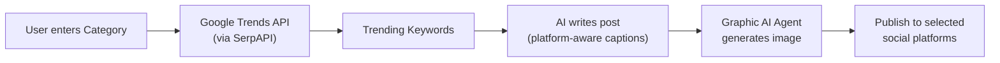

# Smart Post Scheduling Pipeline — Implementation Plan

## Overview
Build a full **category → trends → AI copy → AI graphic → publish** pipeline for the Social Dashboard.

## Architecture

## Components

### 1. Graphic-agents: New `social_post_pipeline` tool + service
| File | Purpose |
|------|---------|
| `app/services/social_post_service.py` | **New** — Orchestrates: trends → caption → graphic |
| `app/tools.py` | **Edit** — Add `generate_social_post` tool |
| `app/api/routes.py` | **Edit** — Add `POST /generate_social_post` endpoint |
| `app/models.py` | **Edit** — Add `SocialPostRequest` / `SocialPostResponse` models |
| `app/config.py` | **Edit** — Add `SOCIAL_POST_WRITER` system prompt |

### 2. Server: Proxy route
| File | Purpose |
|------|---------|
| `src/routes/design/designRoutes.js` | **Edit** — Add `POST /api/design/generate-social-post` proxy |

### 3. Client: `SchedulePostView` component
| File | Purpose |
|------|---------|
| `src/components/social/SchedulePostView.jsx` | **New** — Full scheduling UI |
| `SocialDashboard.jsx` | **Edit** — Wire sidebar + view routing |

## Caption Size Rules (platform-aware)
| Platform | Max Length | Style |
|----------|-----------|-------|
| Twitter/X | 280 chars | Punchy, hashtag-dense |
| LinkedIn | 3000 chars | Professional, story-driven |
| Facebook | 500 chars | Conversational, emoji-friendly |
| Instagram | 2200 chars | Visual, hashtag-heavy (30 max) |

## Image Size Rules (platform-aware)
| Platform | Recommended Size |
|----------|-----------------|
| Twitter/X | 1024x512 (2:1) |
| LinkedIn | 1024x1024 (1:1) |
| Facebook | 1024x1024 (1:1) |
| Instagram | 1024x1024 (1:1) |
