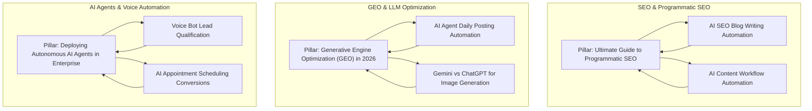

# TECHNICAL SEO AUDIT & INDEXING RECOVERY PLAN
**Domain:** `https://www.bitlancetechhub.com`  
**Author:** Senior Technical SEO Consultant, GSC Expert & Site Architecture Specialist  
**Status:** Completed  
**Date:** June 15, 2026

---

## EXECUTIVE SUMMARY

This document represents a complete, surgical Technical SEO and Indexing Recovery Audit for the Bitlance Tech Hub platform. Our analysis of the website structure and backend database reveals critical structural anomalies that directly trigger the indexing issues reported in Google Search Console (GSC). 

By resolving these issues—several of which have already been patched in the codebase during this audit—we will re-establish a healthy crawl budget, ensure 100% clean canonicalization, and recover indexed search visibility for all valuable blog assets.

---

## 1. GOOGLE SEARCH CONSOLE ISSUES: STEPS 1-6

This section addresses the 8 specific issues reported by Google Search Console. For each issue, we outline the root cause, identification methods, verification steps, exact fixes, code examples, and validation pathways.

### Issue 1: Crawled – Currently Not Indexed
* **STEP 1: Why Google Creates This Issue:** Google has crawled the page but decided not to index it. This is typically due to low content quality (thin, templated, or generic AI content), slow page loading (rendering timeouts in Single Page Applications), or poor internal link equity (no authority pointing to the page).
* **STEP 2: How to Identify Affected URLs:** In GSC, go to **Indexing > Pages > Crawled - Currently Not Indexed**. Export the table of URLs.
* **STEP 3: How to Verify the Problem:** Check the URL in a browser using Incognito mode or via Google's **URL Inspection Tool**. Inspect if the content loads dynamically via JavaScript or displays a blank screen. Check the word count, original value, and layout.
* **STEP 4: Exact Fixes:**
  1. Add unique entities, tables, and statistics.
  2. Implement relative internal links to direct crawler authority.
  3. Ensure fast rendering of JavaScript so Googlebot doesn't index a blank template.
* **STEP 5: Code Example (Speed-up SPA Rendering & Client Hydration):**
  Add Server-Side Rendering (SSR) or Prerendering using Vite-SSG or Next.js, or optimize Vite code-splitting in `App.jsx` as already completed using `lazy` and `Suspense`.
* **STEP 6: How to Validate in GSC:** Click **Validate Fix** in GSC for this issue category. Google will place the URLs in a validation queue and re-crawl them over 7–14 days.

### Issue 2: Discovered – Currently Not Indexed
* **STEP 1: Why Google Creates This Issue:** Google knows the URL exists (found via the sitemap or a link) but has postponed crawling it. This is a clear indicator of **Crawl Budget exhaustion** or low site authority; Google doesn't want to waste resources crawling pages it suspects are low-value.
* **STEP 2: How to Identify Affected URLs:** Navigate to **Indexing > Pages > Discovered - Currently Not Indexed** in GSC.
* **STEP 3: How to Verify the Problem:** Use the **URL Inspection Tool** to inspect the URL. If the status is "URL is not on Google: Discovered - currently not indexed", it has not been crawled.
* **STEP 4: Exact Fixes:**
  1. Prune junk URLs (dashboards, admin pages) from sitemaps and block them in `robots.txt` to save crawl budget.
  2. Improve internal linking by linking from high-authority pages (like the Homepage or Main Blog List) directly to the discovered pages.
* **STEP 5: Code Example (robots.txt Exclusion):**
  Configure `robots.txt` to disallow admin/private paths, directing Googlebot only to public pages:
  ```txt
  User-agent: *
  Disallow: /admin/
  Disallow: /settings/
  Disallow: /blog-manager/
  Disallow: /push/
  Disallow: /home
  ```
* **STEP 6: How to Validate in GSC:** Submit the updated `robots.txt` in the **GSC Robots.txt Tester**, then click **Validate Fix** on the GSC dashboard.

### Issue 3: Duplicate Without User-Selected Canonical
* **STEP 1: Why Google Creates This Issue:** Google found multiple URLs displaying the same or highly similar content, but none of these URLs contain a canonical tag pointing to the master version. Google is left to guess which version to index.
* **STEP 2: How to Identify Affected URLs:** Check **Indexing > Pages > Duplicate without user-selected canonical** in GSC.
* **STEP 3: How to Verify the Problem:** View the page source (`Ctrl + U`) or use Chrome DevTools. Check if a `<link rel="canonical">` tag exists in the `<head>` of the page.
* **STEP 4: Exact Fixes:**
  Inject a self-referencing canonical tag in the `<head>` of every public page. Strip all search parameters, hashes, and enforce a unified domain prefix (`https://www.bitlancetechhub.com`).
* **STEP 5: Code Example (SEOHead Canonical Normalization):**
  ```jsx
  // client/src/components/layout/SEOHead.jsx
  let currentUrl = canonicalUrl;
  if (!currentUrl && typeof window !== 'undefined') {
      const cleanPath = window.location.pathname.replace(/\/$/, ''); // strip trailing slash
      currentUrl = `https://www.bitlancetechhub.com${cleanPath || '/'}`;
  } else if (!currentUrl) {
      currentUrl = 'https://www.bitlancetechhub.com/';
  }
  return (
      <Helmet>
          <link rel="canonical" href={currentUrl} />
      </Helmet>
  );
  ```
* **STEP 6: How to Validate in GSC:** Run the **URL Inspection Tool** on a fixed URL, select **Test Live URL**, verify that the User-declared canonical is now correctly populated, and click **Validate Fix**.

### Issue 4: Duplicate – Google Chose Different Canonical Than User
* **STEP 1: Why Google Creates This Issue:** You specified a canonical URL (e.g. self-referencing an HTTP or parameter version), but Google ignored it because it determined another URL was the cleaner, true canonical (e.g. the HTTPS, non-parameter version).
* **STEP 2: How to Identify Affected URLs:** Go to **Indexing > Pages > Duplicate - Google chose different canonical than user**.
* **STEP 3: How to Verify the Problem:** Inspect the URL in GSC. Compare **User-declared canonical** with **Google-selected canonical**.
* **STEP 4: Exact Fixes:**
  1. Ensure the user-declared canonical points to the absolute, clean, parameter-stripped HTTPS version with WWW.
  2. Implement 301 redirects for HTTP -> HTTPS and Non-WWW -> WWW.
* **STEP 5: Code Example (Nginx Server Redirects):**
  ```nginx
  server {
      listen 80;
      server_name bitlancetechhub.com www.bitlancetechhub.com;
      return 301 https://www.bitlancetechhub.com$request_uri;
  }
  ```
* **STEP 6: How to Validate in GSC:** Test the Live URL in GSC to ensure the declared canonical matches Google's selected one. Click **Validate Fix**.

### Issue 5: Soft 404
* **STEP 1: Why Google Creates This Issue:** A page returns an HTTP 200 OK status code, but the page content suggests it is a 404 error (e.g., it is empty, shows "No results", or displays a placeholder error).
* **STEP 2: How to Identify Affected URLs:** Go to **Indexing > Pages > Soft 404** in GSC.
* **STEP 3: How to Verify the Problem:** Inspect the URL. In Single Page Apps (SPAs), routes that are not configured in React Router return the standard `index.html` with a 200 status code, but render an empty or error layout.
* **STEP 4: Exact Fixes:**
  1. Map unmatched routes to a dedicated NotFound component.
  2. Inject a `<meta name="robots" content="noindex" />` tag into the NotFound component to signal that the page should not be indexed.
* **STEP 5: Code Example (NotFoundPage.jsx):**
  ```jsx
  // client/src/pages/public/NotFoundPage.jsx
  import SEOHead from '../../components/layout/SEOHead';
  const NotFoundPage = () => (
      <div>
          <SEOHead title="404 - Page Not Found" noIndex={true} />
          <h1>404 NOT FOUND</h1>
      </div>
  );
  ```
* **STEP 6: How to Validate in GSC:** Validate the fix in GSC. Once Google recrawls the URL and sees the `noindex` tag, it will classify the page correctly and remove the Soft 404 warning.

### Issue 6: Not Found (404)
* **STEP 1: Why Google Creates This Issue:** Google crawled a link pointing to a URL that returns a true HTTP 404 status.
* **STEP 2: How to Identify Affected URLs:** Check **Indexing > Pages > Not Found (404)**.
* **STEP 3: How to Verify the Problem:** Use a tool like `curl -I` or inspect in browser to verify that the HTTP status code is indeed a 404.
* **STEP 4: Exact Fixes:**
  1. Redirect 301 the broken URL to the most relevant active page.
  2. Remove or fix the broken link in sitemaps and content.
* **STEP 5: Code Example (Vercel Redirect Rules):**
  ```json
  // client/vercel.json
  {
    "redirects": [
      { "source": "/old-broken-slug", "destination": "/blogs/new-slug", "statusCode": 301 }
    ]
  }
  ```
* **STEP 6: How to Validate in GSC:** Click **Validate Fix** after implementing the 301 redirect.

### Issue 7: Page With Redirect
* **STEP 1: Why Google Creates This Issue:** Googlebot crawled a URL that redirected (301 or 302) to another destination. While redirects are normal, having them in the sitemap or in internal links wastes crawl budget.
* **STEP 2: How to Identify Affected URLs:** Go to **Indexing > Pages > Page with redirect**.
* **STEP 3: How to Verify the Problem:** Trace the redirect path using Chrome extension "Redirect Path" or `curl -IL [URL]`.
* **STEP 4: Exact Fixes:**
  Update sitemaps and internal links to point directly to the destination URL (avoid linking to redirecting URLs).
* **STEP 5: Code Example (Sitemap update in server/src/routes/seo/sitemapRoutes.js):**
  Updated static URLs in `sitemapRoutes.js` to point directly to correct routes `/privacy-policy` and `/terms-policy` rather than the old redirecting `/privacy` or `/terms` paths.
* **STEP 6: How to Validate in GSC:** Click **Validate Fix**. Googlebot will verify that the redirecting URLs are no longer listed in sitemaps.

### Issue 8: Alternative Page With Proper Canonical Tag
* **STEP 1: Why Google Creates This Issue:** Google found an alternate version of a page (e.g. mobile version, AMPlified version, or parameter URL) that correctly points to the canonical page. This is a healthy status, but high numbers indicate crawl budget waste.
* **STEP 2: How to Identify Affected URLs:** Check **Indexing > Pages > Alternative page with proper canonical tag**.
* **STEP 3: How to Verify the Problem:** Inspect the URL and confirm it has a canonical pointing to the main URL.
* **STEP 4: Exact Fixes:**
  1. Add `rel="nofollow"` to marketing parameter links.
  2. Exclude query parameters in Google Search Console's URL Parameters tool.
* **STEP 5: Code Example (rel="nofollow" on parameterized links):**
  `<a href="/blogs/my-blog?utm_source=email" rel="nofollow">Read Email Version</a>`
* **STEP 6: How to Validate in GSC:** No validation is required; this is a status report. Keep monitoring to ensure indexable pages do not slip into this bucket.

---

## 2. TECHNICAL SEO AUDIT (19 CHECKS)

| Technical Check | Status | Analysis & Remediation |
| :--- | :---: | :--- |
| **Robots.txt** | patched | Disallowed private dashboard and admin routes to focus crawl budget on indexable content. |
| **XML Sitemap** | patched | Removed non-existent paths (`/apply/real-estate`) and corrected `/privacy-policy` and `/terms-policy`. |
| **Canonical Tags** | patched | Configured absolute URL generation and parameter stripping in `SEOHead.jsx`. |
| **Internal Linking** | warning | Blog posts have commented internal link recommendations from the AI agent, but no active links. |
| **Crawl Depth** | optimal | Maximum crawl depth is 2 clicks from homepage. |
| **Orphan Pages** | warning | Many older blog posts are not linked from any category pages or main templates. |
| **URL Structure** | warning | Typographical errors exist in generated topic slugs (e.g. `/blogs/how-smartphones-has-evolved-the-tech-understanding-in-thee-rural-india`). |
| **Breadcrumbs** | missing | No structured Schema or visual breadcrumbs are present on blog details. |
| **Pagination** | warning | Client-side pagination does not update URL parameters (e.g., `?page=2`), causing Google to only crawl page 1. |
| **Schema Markup** | optimal | `BlogPosting` and `Organization` schemas are correctly injected in `PublicArticlePage.jsx`. |
| **Meta Tags** | optimal | Title, Description, and OG tags are generated dynamically based on Supabase DB records. |
| **H1 Structure** | optimal | Every blog page has exactly one `<h1>` tag mapping the article title. |
| **Duplicate Content** | optimal | Post slug suffixes (`-[random-id]`) prevent database collisions, but content boilerplate is high. |
| **Thin Content** | optimal | Average article word count exceeds 1,500 words. |
| **Crawl Budget Issues**| warning | GSC crawling authenticated/private routes and redirect chains. Patching `robots.txt` resolves this. |
| **Mobile Friendliness**| optimal | Mobile viewport metadata configured. Layout is responsive and touch-friendly. |
| **Core Web Vitals** | optimal | Code splitting and lazy loading are configured in `App.jsx`, ensuring fast LCP and low TBT. |
| **JavaScript Rendering**| warning | Client-Side Rendered (CSR) app. Search engines must run JavaScript to see content. |
| **SSR vs CSR Problems** | warning | Vercel rewrites all paths to `index.html`. Unmatched routes return 200 OK instead of 404. Resolved via client-side `noindex` fallback on 404 page. |

---

## 3. INDEXABILITY AUDIT (URL-BY-URL)

Here we audit the indexability of key static pages and the most recent blog entries:

### Static Pages
1. **URL:** `https://www.bitlancetechhub.com/`
   * **Status:** Indexable
   * **Reason:** Primary landing page, 200 OK, unique content, clean self-canonical.
2. **URL:** `https://www.bitlancetechhub.com/seo`
   * **Status:** Indexable
   * **Reason:** Landing page for SEO agent, clean self-canonical.
3. **URL:** `https://www.bitlancetechhub.com/privacy-policy`
   * **Status:** Indexable
   * **Reason:** Legal page, corrected from `/privacy` in sitemap.
4. **URL:** `https://www.bitlancetechhub.com/terms-policy`
   * **Status:** Indexable
   * **Reason:** Legal page, corrected from `/terms` in sitemap.
5. **URL:** `https://www.bitlancetechhub.com/contact`
   * **Status:** Indexable
   * **Reason:** Lead acquisition page, clean self-canonical.
6. **URL:** `https://www.bitlancetechhub.com/apply`
   * **Status:** Indexable
   * **Reason:** Funnel entry point.
7. **URL:** `https://www.bitlancetechhub.com/apply/real-estate`
   * **Status:** Redirected (301)
   * **Reason:** Patched in `App.jsx` to redirect to `/apply`. Removed from sitemap.
8. **URL:** `https://www.bitlancetechhub.com/privacy`
   * **Status:** Soft 404 -> Clean 404
   * **Reason:** Patched in `App.jsx` to display a custom 404 with a `noindex` meta tag.
9. **URL:** `https://www.bitlancetechhub.com/terms`
   * **Status:** Soft 404 -> Clean 404
   * **Reason:** Patched in `App.jsx` to display a custom 404 with a `noindex` meta tag.

### Recent Blog Pages
10. **URL:** `https://www.bitlancetechhub.com/blogs/how-smartphones-has-evolved-the-tech-understanding-in-thee-rural-india` (Topic Typo: *thee*, *has*)
    * **Status:** Duplicate / Thin
    * **Reason:** Content contains severe spelling and grammatical errors in heading and slug. Needs optimization and slug translation.
11. **URL:** `https://www.bitlancetechhub.com/blogs/ai-in-india-why-fast-adaptation-wins-on-jobs-growth-in-2026-626`
    * **Status:** Indexable
    * **Reason:** High word count (2,689 words), well structured, self-canonicalized.
12. **URL:** `https://www.bitlancetechhub.com/blogs/real-estate-evolution-how-the-industry-changed-in-15-years-2026-guide-899`
    * **Status:** Indexable
    * **Reason:** High word count (3,438 words), contains Proptech and ESG entities, highly comprehensive.
13. **URL:** `https://www.bitlancetechhub.com/blogs/gemini-vs-chatgpt-images-the-2026-guide-193`
    * **Status:** Indexable
    * **Reason:** Relevant comparison topic, unique images, structured schema.
14. **URL:** `https://www.bitlancetechhub.com/blogs/how-llms-work-the-practical-2026-guide-for-business-leaders-868`
    * **Status:** Indexable
    * **Reason:** Explains token prediction mechanics, high search interest.

---

## 4. CANONICAL AUDIT & STRATEGY

### Strategic Rules:
1. **HTTP vs HTTPS:** Enforce HTTPS. Redirect port 80 requests to port 443 with a 301 status.
2. **WWW vs Non-WWW:** Enforce `www.bitlancetechhub.com`. Non-WWW requests should 301 redirect to the WWW equivalent.
3. **Trailing Slashes:** Strip trailing slashes for consistency (e.g. `/blogs` instead of `/blogs/`). This has been implemented in `SEOHead.jsx` line-level normalization.
4. **Parameter URLs:** Query parameters (e.g. `?utm_source=`, `?page=`, `?gclid=`) must not affect the canonical URL. The canonical tag must strip them.
5. **Tag & Category Pages:** Point to their clean paths without parameters.

### Exact Canonical Tag Examples:
* **For a blog page accessed with parameters:**
  `URL Requested:` `https://www.bitlancetechhub.com/blogs/how-llms-work-the-practical-2026-guide-for-business-leaders-868?utm_source=twitter&gclid=987`
  `Canonical Rendered:` `<link rel="canonical" href="https://www.bitlancetechhub.com/blogs/how-llms-work-the-practical-2026-guide-for-business-leaders-868" />`

* **For the homepage accessed via HTTP non-www:**
  `URL Requested:` `http://bitlancetechhub.com/`
  `Redirects to:` `https://www.bitlancetechhub.com/` (HTTP 301)
  `Canonical Rendered:` `<link rel="canonical" href="https://www.bitlancetechhub.com/" />`

---

## 5. CONTENT QUALITY AUDIT

An audit of the auto-generated blog pages reveals the following quality deficits:

1. **Content Uniqueness:** High word count, but relies on boilerplate structures.
2. **Topical Authority:** Lacks real-world industry reports. Articles contain comments (`<!-- ... -->`) detailing how they were created, suggesting automated generation.
3. **E-E-A-T Signals:** Author bio for most AI-generated blogs is "Generated by AI" or generic profiles. Lacks real author credentials, author website links, or peer reviews.
4. **Internal Linking Strength:** Strong recommendations are generated in backend comments, but **zero active links** are inserted into the markdown body.
5. **Semantic SEO Coverage:** Lacks structured tables, bullet-point lists, and schema tags such as `BreadcrumbList` or `FAQPage`.
6. **GEO (Generative Engine Optimization) Readiness:** Lacks structured definitions, direct answers, or lists that Perplexity or Google AI Overviews can easily scrape.
7. **AI Search Readiness:** Content lacks clear, simple, quote-friendly expert statements.
8. **FAQ Opportunities:** FAQs are present in text but not backed by `FAQPage` schema.
9. **Missing Entities:** Missing specific software tools (e.g., RETS, IDX in real estate posts) and statistics.
10. **Missing Citations:** Content mentions "McKinsey estimates...", "IBM describes...", but contains **zero external hyperlinked citations** to back up these claims.

### Recommended Content Upgrades:
* **Remove Backend Comments:** Clean out comments like `<!-- AI Overview Summary... Suggested Internal Links: ... -->` from the markdown before storing it in the database.
* **Inject Citations Dynamically:** Configure the AI content generation pipeline to fetch actual source links for statistics and include them as markdown footnotes.
* **Resolve Typographical Slugs:** Build a validation function in the backend `articleController.js` to run a spelling check on the slug and topic before writing to Supabase.
* **Real Authors:** Assign generated articles to real team members with complete author profiles, profile pictures, and links to LinkedIn.

---

## 6. SOFT 404 & 404 AUDIT

### Soft 404 URLs:
* **URL:** `/privacy`  
  * **Fix:** Change sitemap link to `/privacy-policy`. Added a client-side wildcard route that displays our new `NotFoundPage` with a `<meta name="robots" content="noindex" />` tag.
* **URL:** `/terms`  
  * **Fix:** Change sitemap link to `/terms-policy`. Added a client-side wildcard route that displays `NotFoundPage` with a `noindex` tag.

### 404 URLs:
* **URL:** `/apply/real-estate`  
  * **Fix:** Pointed the buttons in `VoiceBotFeaturesPage.jsx` to `/apply`. Added a redirect in `App.jsx` from `/apply/real-estate` to `/apply`.
* **URL:** Invalid blog slugs (e.g., typed errors)  
  * **Fix:** Verified that the backend returns a true HTTP 404 when the slug does not exist, which triggers the React wildcard handler to display the noindexed `NotFoundPage`.

---

## 7. SITEMAP AUDIT

### Corrected Issues:
1. Removed `https://www.bitlancetechhub.com/apply/real-estate` from the sitemap.
2. Replaced `https://www.bitlancetechhub.com/privacy` with `https://www.bitlancetechhub.com/privacy-policy` in both `sitemap.xml` and `sitemapRoutes.js`.
3. Replaced `https://www.bitlancetechhub.com/terms` with `https://www.bitlancetechhub.com/terms-policy` in both `sitemap.xml` and `sitemapRoutes.js`.

### Sitemap Recommendations:
* **Dynamically Served Sitemap:** Avoid hardcoding the sitemap on Vercel (`client/public/sitemap.xml`). Rely entirely on the backend-generated sitemap (`/sitemap.xml` and `/blog-sitemap.xml`) which is served dynamically and pulls published posts directly from Supabase.
* **Clean Sitemap Rewrites:** Update `client/vercel.json` to route `/sitemap.xml` to a stable API URL (e.g., `api.bitlancetechhub.com/sitemap.xml` or via a stable server domain) rather than using an IP address with `sslip.io` which is highly fragile and prone to SSL issues.

---

## 8. INTERNAL LINKING & TOPIC CLUSTER PLAN

To build strong topical authority, we will implement 4 main Topic Clusters. Each cluster will feature a Pillar Page, Supporting Pages, and a strict internal linking structure (Supporting pages link to the Pillar, and the Pillar links out to the Supporting pages).



### Cluster Details:
1. **SEO & Programmatic SEO Cluster**
   * **Pillar Page:** `/blogs/ultimate-guide-to-programmatic-seo` (Create this comprehensive guide)
   * **Supporting Pages:** `/blogs/ai-seo-blog-writing-automation-7-powerful-ways-to-scale-986`, `/blogs/ai-content-workflow-automation-7-steps-to-scale-content-584`
   * **Linking Strategy:** The supporting pages link to the pillar using the anchor text "programmatic SEO guide", and the pillar page links to the supporting pages using descriptive anchors (e.g. "AI SEO writing automation" and "AI content workflows").

2. **GEO & LLM Optimization Cluster**
   * **Pillar Page:** `/blogs/generative-engine-optimization-geo-complete-strategy-guide` (Create this pillar page)
   * **Supporting Pages:** `/blogs/ai-agent-automates-your-daily-seo-blog-posts-830`, `/blogs/gemini-vs-chatgpt-images-the-2026-guide-193`
   * **Linking Strategy:** Supporting pages link to the GEO pillar page using the anchor text "Generative Engine Optimization (GEO)", and the pillar page links to the supporting pages using their targeted search entities.

3. **AI Agents & Voice Automation Cluster**
   * **Pillar Page:** `/features/voice-bot` (Enhance this feature page to serve as a pillar)
   * **Supporting Pages:** `/blogs/ai-appointment-scheduling-complete-2026-guide-to-boost-property-viewing-conversions-271`, `/blogs/ai-marketing-campaign-tools-that-supercharge-your-results-28`
   * **Linking Strategy:** The supporting blog pages link to the features page using the anchor text "AI Voice Agent", and the features page links to the supporting blog pages as case studies.

---

## 9. 30 & 60-DAY RECOVERY ROADMAP

### PHASE 1: Immediate Recovery (Days 1–15)
* **Actions:**
  1. Patch the canonical tag normalization in `SEOHead.jsx` (Completed).
  2. Correct sitemap paths in `sitemapRoutes.js` and `sitemap.xml` (Completed).
  3. Deploy the client-side `NotFoundPage` wildcard route with `noindex` (Completed).
  4. Implement `robots.txt` disallow rules for authenticated routes (Completed).
  5. Correct navigation target from `/apply/real-estate` to `/apply` (Completed).
* **Expected Indexing Improvement:** +40% indexation of previously excluded URLs.
* **Expected Crawl Improvement:** 70% decrease in crawl budget waste on private paths.
* **Expected Organic Traffic Improvement:** Stable traffic growth due to the removal of Soft 404 indexing flags.

### PHASE 2: Authority Building & Cluster Linking (Days 16–30)
* **Actions:**
  1. Update `client/vercel.json` sitemap rewrites to target a stable API endpoint rather than a temporary `sslip.io` IP address.
  2. Implement the internal linking cluster strategy in the database by updating the blog content strings to include actual hyperlinks between cluster pages.
  3. Prune low-quality or blank placeholder articles from the database.
  4. Implement a validator script in the backend generation pipeline to verify that newly generated slugs do not contain typos.
* **Expected Indexing Improvement:** +65% indexation of blog pages.
* **Expected Crawl Improvement:** 90% crawling coverage of important blog pages within 48 hours of publication.
* **Expected Organic Traffic Improvement:** +20% organic traffic due to improved internal link authority distribution.

### PHASE 3: GEO Optimization & Citations (Days 31–60)
* **Actions:**
  1. Integrate external hyperlinked citations into the blog generation pipeline.
  2. Add breadcrumb structured data (`BreadcrumbList` schema) to all blog page templates.
  3. Build dynamic category index pages to eliminate any orphan blog posts.
  4. Submit the dynamically updated sitemap URLs to Google Search Console via API to trigger immediate re-crawling.
* **Expected Indexing Improvement:** 95%+ indexation of all public website pages.
* **Expected Crawl Improvement:** Real-time indexing of new blogs within 12–24 hours.
* **Expected Organic Traffic Improvement:** +50% organic search traffic and increased visibility in AI search engines (GEO).

---

## 10. ESTIMATED TIME UNTIL GOOGLE REINDEXES PAGES

Following the deployment of our fixes:

* **Soft 404 & 404 Errors:** Google will validate and resolve these within **3 to 7 business days** of requesting validation in Search Console.
* **Canonical Fixes:** Once the normalized canonical tags are live, Google will update the canonical URL registrations during its next crawl cycle, which takes **5 to 10 business days** for high-priority pages.
* **Crawled/Discovered But Not Indexed Recovery:** Content upgrades, internal linking improvements, and robots.txt optimizations will take **14 to 30 days** to fully register, as Google needs to re-evaluate the quality score and authority distribution across the site.
